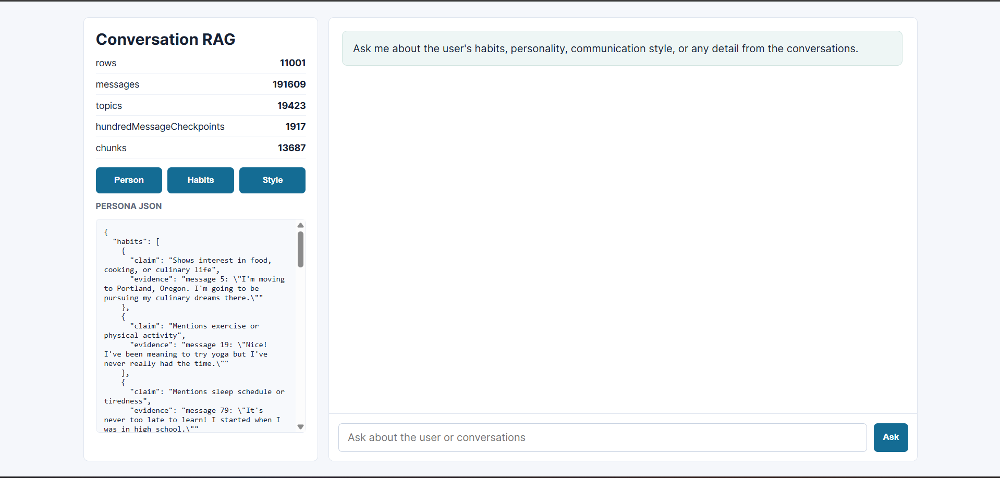
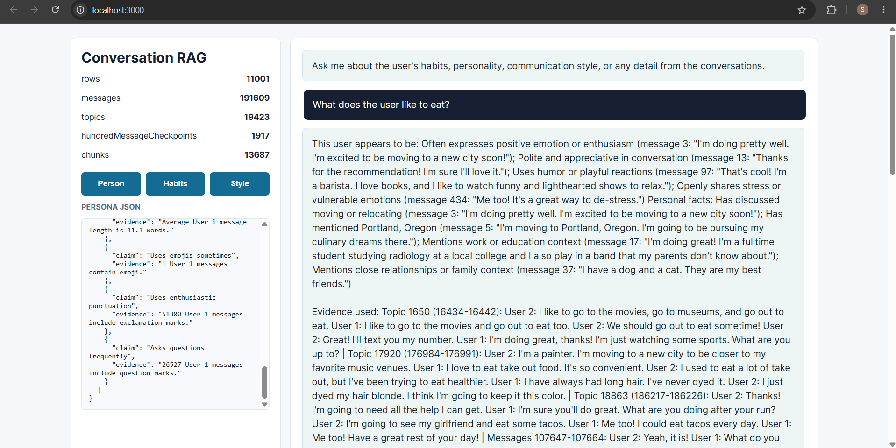

# Conversation RAG Chatbot

> A fully local, no-API RAG chatbot that processes a CSV of daily conversations, builds topic & 100-message checkpoints, extracts a user persona, and serves a chat interface — all without any external AI service.

---

## Demo Video

> **[Watch the Demo](https://drive.google.com/file/d/1dnV7BcaXmSnCm54pA_oJ9NZVZ2tRFyBQ/view?usp=sharing)**

---

## Screenshots

### Chat Interface
Open `http://localhost:3000` to see the full chat UI.



### Query Result



| Endpoint | What it shows |
|----------|--------------|
| `http://localhost:3000` | Chat UI — ask any question |
| `http://localhost:3000/api/stats` | Index stats + sample topics |
| `http://localhost:3000/api/persona` | Extracted user persona |

### Example Queries to Try

```
What are the user's habits?
How does this user communicate?
What topics were discussed most?
Tell me about the user's personality
What happened around message 500?
```

### Sample API Response — `/api/stats`
```json
{
  "stats": {
    "rows": 11001,
    "messages": 191609,
    "topics": 19423,
    "hundredMessageCheckpoints": 1917,
    "chunks": 13687
  },
  "sampleTopics": [...]
}
```

### Sample API Response — `/api/query`
```json
{
  "answer": "Habits: Shows interest in food, cooking, or culinary life (message 42: \"...\"); Mentions sleep schedule or tiredness (message 108: \"...\")\n\nEvidence used: Topic 1 (1-23): ...",
  "retrieved": {
    "topics": [...],
    "chunks": [...],
    "hundredCheckpoints": [...]
  }
}
```

---

## 🚀 Run Locally

```bash
npm install
npm run build:index
npm start
```

Open `http://localhost:3000`.

The dataset is expected at `data/conversations.csv`. You can also build from another file:

```bash
node src/build_index.js path/to/conversations.csv
```

---

## 📦 Outputs

Processed artifacts are written to `data/processed/`:

| File | Description |
|------|-------------|
| `messages.json` | Chronological message list with speaker, text, day, and id |
| `topic_checkpoints.json` | Topic segments with message ranges, labels, and summaries |
| `hundred_message_checkpoints.json` | Independent 100-message summaries |
| `persona.json` | Structured user persona with evidence |
| `index.json` | Complete retrieval index used by the chatbot (includes vectors) |

---

## 🔍 How Topic Change Detection Works

The pipeline reads CSV rows in order, then splits each row into speaker turns (`User 1:`, `User 2:`). Every message gets a global chronological message id.

Topic detection is **online** — it scans messages one by one and decides whether to close the current topic segment using three complementary signals:

### Signals Used

| Signal | Description |
|--------|-------------|
| **Token cosine similarity** | Compares TF (term-frequency) vectors of the incoming message vs. a rolling 12-message window. If cosine < 0.05, the topic has likely shifted. |
| **Lexical Jaccard overlap** | Measures token-level word overlap between the new message and the rolling window. If Jaccard < 0.04, topics diverged. |
| **Day boundary** | A new calendar day is used as a weak booster signal — if similarity is also low (< 0.08) and the segment is long enough (≥ 25 messages), a checkpoint is created. |
| **Maximum segment length** | If a segment exceeds 55 messages and similarity < 0.12, it is split even without a strong topic shift (guardrail against huge generic segments). |

### Topic Checkpoint Trigger Conditions

```
topicShift  = enoughMessages (≥8) AND cosine < 0.05 AND jaccard < 0.04
longSegment = segment ≥ 55 messages AND cosine < 0.12
dayBoundary = new day AND segment ≥ 25 AND cosine < 0.08
```

A checkpoint is created when **any** of these conditions is true.

### Checkpoint Contents

Each topic checkpoint stores:
- `startMessage` / `endMessage` — message id range
- `label` — top 5 keywords from the segment
- `summary` — extractive summary using the highest-signal messages (scored by keyword density + length)
- `keywords` — top 12 keywords

> **Why extractive summaries?** They never blend a later topic's content into an earlier summary — every summary sentence comes directly from that segment.

---

## 🔎 How Retrieval Works

At query time the system performs **multi-index retrieval** across three separate vector stores:

### Step 1 — Vectorisation (build time)

Every item is converted to a **TF (term-frequency) vector** at index-build time:

```
topic vector    ← label + summary + keywords
chunk vector    ← raw message text + keywords
hundred vector  ← summary + keywords
```

Stop words are stripped and tokens are lowercased before vectorising.

### Step 2 — Scoring (query time)

For each candidate item, the score is:

```
score = cosine_similarity(queryVector, itemVector)
      + jaccard_overlap(queryText, itemText) × 0.35
```

Combining **cosine** (handles vocabulary frequency) with **jaccard** (rewards exact term overlap) gives better precision than either alone.

### Step 3 — Multi-index merge

```
Top 3 topic summaries   (most relevant topic segments)
Top 6 message chunks    (overlapping 18-message windows, 4-message overlap)
Top 2 hundred-checkpoints  (broad 100-message summaries)
```

All three are returned together so the answer can blend granular evidence with broad context.

### Step 4 — Answer Generation

```
if query asks about persona/habits/communication:
    → pull directly from persona store
else:
    → build answer from top topic summaries + message chunks

always append: evidence citation with message id ranges
```

No LLM is used — answers are assembled from retrieved evidence text directly.

---

## 👤 How Persona Is Built

The persona extractor runs once at index-build time over all `User 1` messages (falls back to all messages if no User 1 is detected).

### Four Persona Buckets

| Bucket | What it captures |
|--------|-----------------|
| `habits` | Food/cooking, exercise, sleep schedule, drink routines |
| `personal_facts` | Locations mentioned, relationships/family, work/education |
| `personality_traits` | Positive emotion, stress/anxiety, humor, politeness |
| `communication_style` | Message length, emoji usage, exclamation rate, question rate |

### Signal Matching

Each signal is a regex pattern matched against the lowercase message text:

```js
/culinary|cook|cooking|chef|baking|restaurant|food/  → habit: "food & cooking interest"
/gym|workout|run|exercise|yoga/                       → habit: "exercise or physical activity"
/late|midnight|sleep|slept|awake|tired/               → habit: "mentions sleep schedule"
/excited|awesome|love|happy|glad/                     → trait: "positive emotion/enthusiasm"
/haha|lol|funny|joke/                                 → trait: "uses humor"
/sorry|thanks|thank you|appreciate/                   → trait: "polite and appreciative"
```

### Communication Style (aggregate)

Communication style is computed from **aggregate statistics** rather than per-message regex:

| Metric | Rule |
|--------|------|
| Avg message length < 8 words | → "Usually sends short messages" |
| Avg message length > 18 words | → "Often writes detailed messages" |
| Emoji count > 0 | → "Uses emojis sometimes" |
| Exclamation rate > 12% | → "Uses enthusiastic punctuation" |
| Question rate > 18% | → "Asks questions frequently" |

### Evidence Anchoring

Every finding stores the **exact message id and text snippet** that triggered it:

```json
{
  "claim": "Shows interest in food, cooking, or culinary life",
  "evidence": "message 42: \"I tried making sourdough last night and...\""
}
```

Max 12 findings per bucket are kept to avoid noise.

---

## 🌐 API Reference

| Method | Endpoint | Description |
|--------|----------|-------------|
| `GET` | `/api/stats` | Index stats, persona overview, and 8 sample topic labels |
| `GET` | `/api/persona` | Full extracted persona JSON |
| `POST` | `/api/retrieve` | Raw retrieval — body: `{ "query": "...", "limit": 6 }` |
| `POST` | `/api/query` | Chat answer + evidence — body: `{ "query": "..." }` |

### PowerShell Test Commands

```powershell
# Stats
Invoke-RestMethod http://localhost:3000/api/stats | ConvertTo-Json -Depth 4

# Persona
Invoke-RestMethod http://localhost:3000/api/persona | ConvertTo-Json -Depth 4

# Ask a question
Invoke-RestMethod -Method POST -Uri http://localhost:3000/api/query `
  -ContentType "application/json" `
  -Body '{"query": "What are the user habits?"}'

# Raw retrieve
Invoke-RestMethod -Method POST -Uri http://localhost:3000/api/retrieve `
  -ContentType "application/json" `
  -Body '{"query": "food cooking", "limit": 5}'
```

---

## ☁️ Cloud Hosting

Deploy to Render, Railway, or any Node host.

**Build command:**
```bash
npm install && npm run build:index
```

**Start command:**
```bash
npm start
```

Set `PORT` only if your host requires it.

---

## 🏗️ Architecture

```
conversations.csv
       │
       â–¼
  csv.js ──► parseCsvRows + conversationsToMessages
       │
       ├──► rag.js ──► createTopicCheckpoints   ──► topic_checkpoints.json
       │          ──► createHundredCheckpoints  ──► hundred_message_checkpoints.json
       │          ──► createMessageChunks       ──► (retrieval chunks)
       │          ──► attachVectors             ──► TF vectors on all items
       │
       ├──► persona.js ──► buildPersona         ──► persona.json
       │
       └──► index.json  (all of the above merged)
                │
                â–¼
           server.js  ──► Express API + static UI at :3000
```
